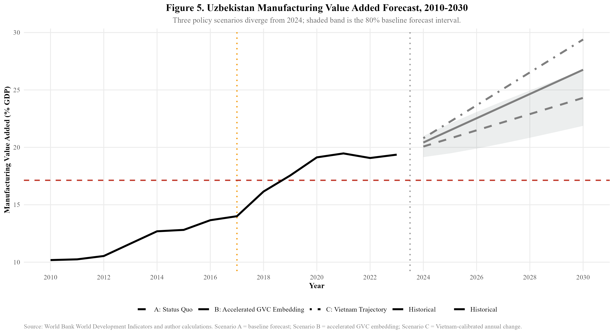
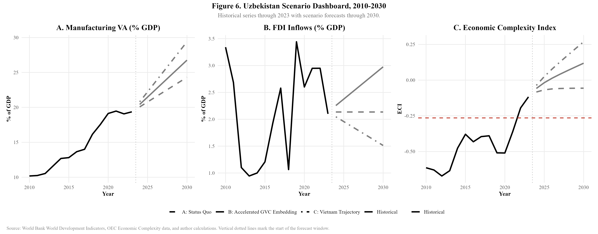

## Reproducibility Setup

```{r}
#| label: setup
#| include: false
knitr::opts_chunk$set(
  fig.width = 8,
  fig.height = 5,
  dpi = 300,
  dev = "png"
)

source("scripts/00_setup.R")

dir.create("data/processed", recursive = TRUE, showWarnings = FALSE)
dir.create("output/figures", recursive = TRUE, showWarnings = FALSE)
dir.create("output/logs", recursive = TRUE, showWarnings = FALSE)
dir.create("output/tables", recursive = TRUE, showWarnings = FALSE)

safe_mean <- function(x) {
  if (all(is.na(x))) {
    return(NA_real_)
  }
  mean(x, na.rm = TRUE)
}

safe_sd <- function(x) {
  if (sum(!is.na(x)) < 2) {
    return(NA_real_)
  }
  sd(x, na.rm = TRUE)
}

safe_max <- function(x) {
  if (all(is.na(x))) {
    return(NA_real_)
  }
  max(x, na.rm = TRUE)
}

robust_tidy <- function(model, outcome) {
  robust_matrix <- lmtest::coeftest(
    model,
    vcov. = sandwich::vcovHC(model, type = "HC1")
  )

  tibble(
    outcome = outcome,
    term = rownames(robust_matrix),
    estimate = robust_matrix[, 1],
    robust_se = robust_matrix[, 2],
    statistic = robust_matrix[, 3],
    p_value = robust_matrix[, 4]
  )
}

model_tidy <- function(model, outcome) {
  broom::tidy(model) %>%
    mutate(outcome = outcome, .before = 1)
}
```

```{r}
#| label: data-refresh
#| include: false
processed_required <- c(
  "data/processed/wb_indicators.rds",
  "data/processed/fdi_uzbek.rds",
  "data/processed/exports_comtrade.rds",
  "data/processed/eci_data.rds"
)

refresh_data <- exists("params") && isTRUE(params$refresh_data)

if (refresh_data || !all(file.exists(processed_required))) {
  source("scripts/01_data_cleaning.R")
}

wb_data <- readRDS("data/processed/wb_indicators.rds")
fdi_uzbek <- readRDS("data/processed/fdi_uzbek.rds")
exports <- readRDS("data/processed/exports_comtrade.rds")
eci_data <- readRDS("data/processed/eci_data.rds")
```

This report is the primary statistical workflow. It uses Quarto executable R chunks to clean or load data, estimate models, produce tables, and save figures.

## Descriptive Statistics

```{r}
#| label: descriptive-country-summary
country_summary <- wb_data %>%
  group_by(country_code, country) %>%
  summarise(
    years = paste(min(year, na.rm = TRUE), max(year, na.rm = TRUE), sep = "-"),
    observations = n(),
    mean_manuf_va_gdp = round(safe_mean(manuf_va_gdp), 2),
    sd_manuf_va_gdp = round(safe_sd(manuf_va_gdp), 2),
    mean_fdi_gdp = round(safe_mean(fdi_gdp), 2),
    sd_fdi_gdp = round(safe_sd(fdi_gdp), 2),
    mean_gdp_per_capita = round(safe_mean(gdp_per_capita), 2),
    mean_lpi_score = round(safe_mean(lpi_score), 2),
    mean_doing_business_score = round(safe_mean(doing_business_score), 2),
    .groups = "drop"
  )

write_csv(country_summary, "output/tables/table_descriptive_country_summary.csv")
knitr::kable(country_summary)
```

```{r}
#| label: uzbekistan-pre-post-summary
uzb_pre_post <- wb_data %>%
  filter(country_code == "UZB") %>%
  mutate(period = if_else(year < 2017, "Pre-2017", "Post-2017")) %>%
  group_by(period) %>%
  summarise(
    years = paste(min(year, na.rm = TRUE), max(year, na.rm = TRUE), sep = "-"),
    mean_manuf_va_gdp = round(safe_mean(manuf_va_gdp), 2),
    mean_fdi_gdp = round(safe_mean(fdi_gdp), 2),
    mean_gdp_per_capita = round(safe_mean(gdp_per_capita), 2),
    mean_unemployment = round(safe_mean(unemployment), 2),
    .groups = "drop"
  )

write_csv(uzb_pre_post, "output/tables/table_uzbekistan_pre_post.csv")
knitr::kable(uzb_pre_post)
```

```{r}
#| label: indicator-trends
#| fig-cap: "Key macroeconomic indicators for Uzbekistan and Vietnam, 2010-2023."
indicator_trends <- wb_data %>%
  filter(country_code %in% c("UZB", "VNM")) %>%
  select(country_code, country, year, manuf_va_gdp, fdi_gdp, gdp_per_capita) %>%
  pivot_longer(
    cols = c(manuf_va_gdp, fdi_gdp, gdp_per_capita),
    names_to = "indicator",
    values_to = "value"
  ) %>%
  mutate(
    indicator = recode(
      indicator,
      manuf_va_gdp = "Manufacturing value added (% GDP)",
      fdi_gdp = "FDI inflows (% GDP)",
      gdp_per_capita = "GDP per capita (current US$)"
    )
  )

fig_indicator_trends <- ggplot(
  indicator_trends,
  aes(x = year, y = value, color = country_code, group = country_code)
) +
  geom_line(linewidth = 1, na.rm = TRUE) +
  geom_point(size = 2, na.rm = TRUE) +
  facet_wrap(~ indicator, scales = "free_y") +
  scale_color_manual(
    values = c("UZB" = thesis_colours["uzbekistan"], "VNM" = thesis_colours["vietnam"]),
    labels = c("UZB" = "Uzbekistan", "VNM" = "Vietnam")
  ) +
  labs(
    title = "Key Indicator Trends",
    x = "Year",
    y = NULL,
    color = NULL,
    caption = "Source: World Bank World Development Indicators."
  )

ggsave(
  "output/figures/fig0_indicator_trends.png",
  fig_indicator_trends,
  width = 10,
  height = 6,
  dpi = 300,
  bg = "white"
)

fig_indicator_trends
```

## Trend Regressions

```{r}
#| label: trend-regressions
uzb_ts <- wb_data %>%
  filter(country_code == "UZB") %>%
  arrange(year) %>%
  select(year, manuf_va_gdp, fdi_gdp) %>%
  mutate(
    post_reform = if_else(year >= 2017, 1, 0),
    time_trend = year - min(year, na.rm = TRUE),
    interaction = post_reform * time_trend
  )

model_manuf <- lm(
  manuf_va_gdp ~ time_trend + post_reform + interaction,
  data = filter(uzb_ts, !is.na(manuf_va_gdp))
)

model_fdi <- lm(
  fdi_gdp ~ time_trend + post_reform + interaction,
  data = filter(uzb_ts, !is.na(fdi_gdp))
)

trend_table <- bind_rows(
  robust_tidy(model_manuf, "Manufacturing VA (% GDP)"),
  robust_tidy(model_fdi, "FDI inflows (% GDP)")
) %>%
  mutate(
    estimate = round(estimate, 4),
    robust_se = round(robust_se, 4),
    statistic = round(statistic, 3),
    p_value = round(p_value, 4)
  )

trend_fit <- bind_rows(
  broom::glance(model_manuf) %>% mutate(outcome = "Manufacturing VA (% GDP)", .before = 1),
  broom::glance(model_fdi) %>% mutate(outcome = "FDI inflows (% GDP)", .before = 1)
) %>%
  select(outcome, r.squared, adj.r.squared, statistic, p.value, df, df.residual, nobs) %>%
  mutate(across(where(is.numeric), ~ round(.x, 4)))

write_csv(trend_table, "output/tables/table_trend_regressions_robust.csv")
write_csv(trend_fit, "output/tables/table_trend_regression_fit.csv")

knitr::kable(trend_table)
```

```{r}
#| label: trend-regression-fit
knitr::kable(trend_fit)
```

## Structural Break Test

```{r}
#| label: chow-test
if (!2017 %in% uzb_ts$year) {
  stop("Cannot run Chow test: year 2017 is not present in Uzbekistan data.")
}

model_pre <- lm(
  manuf_va_gdp ~ time_trend,
  data = filter(uzb_ts, year < 2017, !is.na(manuf_va_gdp))
)

model_post <- lm(
  manuf_va_gdp ~ time_trend,
  data = filter(uzb_ts, year >= 2017, !is.na(manuf_va_gdp))
)

breakpoint_index <- which(uzb_ts$year == 2017)
chow_result <- strucchange::sctest(
  manuf_va_gdp ~ time_trend,
  type = "Chow",
  point = breakpoint_index,
  data = filter(uzb_ts, !is.na(manuf_va_gdp))
)

chow_table <- tibble(
  test = "Chow structural break test",
  breakpoint_year = 2017,
  statistic = round(as.numeric(chow_result$statistic), 4),
  p_value = round(as.numeric(chow_result$p.value), 4),
  interpretation = if_else(
    chow_result$p.value < 0.05,
    "Reject H0: statistically significant break",
    "Fail to reject H0: no statistically significant break"
  )
)

write_csv(chow_table, "output/tables/table_chow_test.csv")
knitr::kable(chow_table)
```

```{r}
#| label: structural-break-figure
#| fig-cap: "Manufacturing value added in Uzbekistan with 2017 reform breakpoint."
fig_structural_break <- ggplot(uzb_ts, aes(x = year, y = manuf_va_gdp)) +
  geom_vline(
    xintercept = 2017,
    linetype = "dashed",
    color = thesis_colours["highlight"],
    linewidth = 1
  ) +
  geom_point(size = 3, color = thesis_colours["uzbekistan"]) +
  geom_smooth(
    data = filter(uzb_ts, year < 2017),
    method = "lm",
    se = TRUE,
    color = thesis_colours["neutral"],
    fill = "grey80"
  ) +
  geom_smooth(
    data = filter(uzb_ts, year >= 2017),
    method = "lm",
    se = TRUE,
    color = thesis_colours["uzbekistan"],
    fill = "#AED6F1"
  ) +
  annotate(
    "text",
    x = 2017.2,
    y = max(uzb_ts$manuf_va_gdp, na.rm = TRUE),
    label = "Reform\nbreakpoint",
    hjust = 0,
    size = 3.5,
    color = thesis_colours["highlight"]
  ) +
  labs(
    title = "Manufacturing Value Added in Uzbekistan",
    subtitle = "Structural break test at 2017 reform breakpoint",
    x = "Year",
    y = "Manufacturing VA (% of GDP)",
    caption = paste0(
      "Source: World Bank World Development Indicators.\n",
      "Chow test F-stat: ", round(chow_result$statistic, 3),
      ", p = ", round(chow_result$p.value, 3)
    )
  )

ggsave(
  "output/figures/fig1_structural_break.png",
  fig_structural_break,
  width = 8,
  height = 5,
  dpi = 300,
  bg = "white"
)

fig_structural_break
```

## Revealed Comparative Advantage

```{r}
#| label: rca-calculation
if (n_distinct(exports$country_code) < 2 &&
    file.exists("data/raw/vietnam_comparison.csv")) {
  vnm_exports <- read_csv(
    "data/raw/vietnam_comparison.csv",
    show_col_types = FALSE
  ) %>%
    filter(dataset == "exports_by_hs_section") %>%
    transmute(
      country_code = country_code,
      country = country,
      year = as.integer(year),
      hs_section_code = case_when(
        variable == "Animal Products" ~ "01",
        variable == "Vegetable Products" ~ "02",
        variable == "Animal and Vegetable Bi-Products" ~ "03",
        variable == "Foodstuffs" ~ "04",
        variable == "Mineral Products" ~ "05",
        variable == "Chemical Products" ~ "06",
        variable == "Plastics and Rubbers" ~ "07",
        variable == "Animal Hides" ~ "08",
        variable == "Wood Products" ~ "09",
        variable == "Paper Goods" ~ "10",
        variable == "Textiles" ~ "11",
        variable == "Footwear and Headwear" ~ "12",
        variable == "Stone And Glass" ~ "13",
        variable == "Precious Metals" ~ "14",
        variable == "Metals" ~ "15",
        variable == "Machines" ~ "16",
        variable == "Transportation" ~ "17",
        variable == "Instruments" ~ "18",
        variable == "Weapons" ~ "19",
        variable == "Miscellaneous" ~ "20",
        variable == "Arts and Antiques" ~ "21",
        TRUE ~ NA_character_
      ),
      hs_section = variable,
      value_usd = as.numeric(value),
      source = source,
      source_url = NA_character_
    ) %>%
    filter(!is.na(hs_section_code))

  exports <- bind_rows(exports, vnm_exports)
}

rca_results <- exports %>%
  filter(country_code %in% c("UZB", "VNM")) %>%
  group_by(year, country_code) %>%
  mutate(total_exports_country = sum(value_usd, na.rm = TRUE)) %>%
  ungroup() %>%
  group_by(year, hs_section_code) %>%
  mutate(total_exports_product = sum(value_usd, na.rm = TRUE)) %>%
  ungroup() %>%
  group_by(year) %>%
  mutate(total_world = sum(value_usd, na.rm = TRUE)) %>%
  ungroup() %>%
  mutate(
    export_share_country = value_usd / total_exports_country,
    export_share_world = total_exports_product / total_world,
    rca = export_share_country / export_share_world,
    has_rca = if_else(
      rca > 1,
      "RCA > 1 (Comparative Advantage)",
      "RCA <= 1 (No Advantage)"
    )
  ) %>%
  select(
    country_code,
    country,
    year,
    hs_section_code,
    product = hs_section,
    value_usd,
    export_share_country,
    export_share_world,
    rca,
    has_rca
  )

rca_uzb <- rca_results %>%
  filter(country_code == "UZB") %>%
  arrange(year, desc(rca))

manufacturing_sections <- c("11", "15", "16", "17", "18")

rca_diversification <- rca_uzb %>%
  group_by(year) %>%
  summarise(
    sectors_with_rca = sum(rca > 1, na.rm = TRUE),
    mean_rca_manuf = round(
      safe_mean(rca[hs_section_code %in% manufacturing_sections]),
      3
    ),
    .groups = "drop"
  )

write_csv(rca_results, "data/processed/rca_results.csv")
saveRDS(rca_results, "data/processed/rca_results.rds")
write_csv(rca_diversification, "output/tables/table_rca_diversification.csv")

knitr::kable(rca_diversification)
```

```{r}
#| label: rca-heatmap
#| fig-cap: "Revealed comparative advantage for Uzbekistan top export sections."
rca_top_sectors <- rca_uzb %>%
  filter(year %in% c(2015, 2018, 2020, 2022, 2023)) %>%
  group_by(year) %>%
  slice_max(order_by = rca, n = 10, with_ties = FALSE) %>%
  ungroup()

fig_rca_heatmap <- ggplot(
  rca_top_sectors,
  aes(x = factor(year), y = reorder(product, rca), fill = rca)
) +
  geom_tile(color = "white") +
  scale_fill_gradient2(
    low = "#EBF5FB",
    mid = "#3498DB",
    high = "#1B4F72",
    midpoint = 2,
    name = "RCA Index"
  ) +
  labs(
    title = "Revealed Comparative Advantage - Uzbekistan",
    subtitle = "Top export sections by RCA index, selected years",
    x = "Year",
    y = "Export Section",
    caption = paste0(
      "Source: Author calculations based on OEC/BACI export data.\n",
      "RCA > 1 indicates revealed comparative advantage."
    )
  ) +
  theme(axis.text.y = element_text(size = 8))

ggsave(
  "output/figures/fig2_rca_heatmap.png",
  fig_rca_heatmap,
  width = 10,
  height = 7,
  dpi = 300,
  bg = "white"
)

fig_rca_heatmap
```

```{r}
#| label: rca-manufacturing
#| fig-cap: "Manufacturing-related RCA trends for Uzbekistan."
fig_rca_manuf <- ggplot(
  filter(rca_uzb, hs_section_code %in% manufacturing_sections),
  aes(x = year, y = rca, color = product, group = product)
) +
  geom_line(linewidth = 1) +
  geom_point(size = 2.5) +
  geom_hline(
    yintercept = 1,
    linetype = "dashed",
    color = "red",
    alpha = 0.7
  ) +
  annotate(
    "text",
    x = 2015.5,
    y = 1.05,
    label = "RCA = 1 threshold",
    size = 3,
    color = "red"
  ) +
  labs(
    title = "Manufacturing-Related RCA Trends - Uzbekistan",
    subtitle = "Textiles, metals, machines, transportation, and instruments",
    x = "Year",
    y = "RCA Index",
    color = "Section",
    caption = "Source: Author calculations based on OEC/BACI export data."
  )

ggsave(
  "output/figures/fig3_rca_manufacturing.png",
  fig_rca_manuf,
  width = 9,
  height = 5.5,
  dpi = 300,
  bg = "white"
)

fig_rca_manuf
```

## Comparative Reform Trajectory

```{r}
#| label: comparative-data
vnm_early <- NULL

if (!any(wb_data$country_code == "VNM" & wb_data$year %in% 2000:2008) &&
    refresh_data) {
  vnm_early <- tryCatch(
    WDI(
      country = "VNM",
      indicator = c(
        "NV.IND.MANF.ZS",
        "BX.KLT.DINV.WD.GD.ZS",
        "LP.LPI.OVRL.XQ"
      ),
      start = 2000,
      end = 2008,
      extra = TRUE
    ) %>%
      rename(
        country_code = iso3c,
        manuf_va_gdp = NV.IND.MANF.ZS,
        fdi_gdp = BX.KLT.DINV.WD.GD.ZS,
        lpi_score = LP.LPI.OVRL.XQ
      ) %>%
      mutate(
        doing_business_rank = NA_real_,
        doing_business_score = NA_real_
      ),
    error = function(e) NULL
  )
}

if (!is.null(vnm_early)) {
  wb_data <- bind_rows(wb_data, vnm_early)
}

if (any(wb_data$country_code == "VNM" & wb_data$year %in% 2000:2008)) {
  vnm_reform <- wb_data %>%
    filter(country_code == "VNM", year %in% 2000:2008) %>%
    mutate(
      reform_year = year - 2000,
      country_label = "Vietnam (post-2000)"
    )

  uzb_reform <- wb_data %>%
    filter(country_code == "UZB", year %in% 2017:2023) %>%
    mutate(
      reform_year = year - 2017,
      country_label = "Uzbekistan (post-2017)"
    )

  comparison_data <- bind_rows(vnm_reform, uzb_reform) %>%
    select(
      country_label,
      country_code,
      year,
      reform_year,
      manuf_va_gdp,
      fdi_gdp,
      lpi_score,
      doing_business_score
    )

  comparison_note <- "Vietnam and Uzbekistan are aligned by reform stage."
} else if (file.exists("data/processed/comparative_reform_trajectory.csv")) {
  comparison_data <- read_csv(
    "data/processed/comparative_reform_trajectory.csv",
    show_col_types = FALSE
  )

  comparison_note <- paste(
    "Using the cached processed reform-stage comparison table.",
    "Set params.refresh_data to true to rebuild early Vietnam data from WDI."
  )
} else {
  comparison_data <- wb_data %>%
    filter(country_code %in% c("UZB", "VNM"), year %in% 2017:2023) %>%
    mutate(
      reform_year = year - 2017,
      country_label = case_when(
        country_code == "UZB" ~ "Uzbekistan (2017-2023)",
        country_code == "VNM" ~ "Vietnam (2017-2023)",
        TRUE ~ country_code
      )
    ) %>%
    select(
      country_label,
      country_code,
      year,
      reform_year,
      manuf_va_gdp,
      fdi_gdp,
      lpi_score,
      doing_business_score
    )

  comparison_note <- paste(
    "Early Vietnam reform-stage data were unavailable.",
    "This fallback compares both countries over 2017-2023."
  )
}

write_csv(comparison_data, "data/processed/comparative_reform_trajectory.csv")
cat(comparison_note)
```

```{r}
#| label: comparative-scorecard
eci_reform <- eci_data %>%
  mutate(
    reform_year = case_when(
      country_code == "VNM" ~ year - 2000,
      country_code == "UZB" ~ year - 2017,
      TRUE ~ NA_integer_
    ),
    country_label = case_when(
      country_code == "VNM" ~ "Vietnam (post-2000)",
      country_code == "UZB" ~ "Uzbekistan (post-2017)",
      TRUE ~ country_code
    )
  ) %>%
  filter(
    country_code %in% c("UZB", "VNM"),
    reform_year >= 0,
    reform_year <= 8
  )

scorecard <- comparison_data %>%
  group_by(country_label) %>%
  summarise(
    `Avg Manufacturing VA (% GDP)` = round(safe_mean(manuf_va_gdp), 2),
    `Avg FDI (% GDP)` = round(safe_mean(fdi_gdp), 2),
    `Avg LPI Score` = round(safe_mean(lpi_score), 2),
    `Avg Doing Business Score` = round(safe_mean(doing_business_score), 2),
    `Peak FDI (% GDP)` = round(safe_max(fdi_gdp), 2),
    .groups = "drop"
  )

eci_scorecard <- eci_reform %>%
  group_by(country_label) %>%
  summarise(
    `Avg ECI` = round(safe_mean(eci), 3),
    .groups = "drop"
  )

scorecard <- scorecard %>%
  left_join(eci_scorecard, by = "country_label")

write_csv(scorecard, "output/tables/table_comparison_scorecard.csv")
knitr::kable(scorecard)
```

```{r}
#| label: comparative-figure
#| fig-cap: "Uzbekistan and Vietnam reform trajectory comparison."
comparison_colours <- c(
  "Vietnam (post-2000)" = unname(thesis_colours["neutral"]),
  "Uzbekistan (post-2017)" = unname(thesis_colours["uzbekistan"]),
  "Vietnam (2017-2023)" = unname(thesis_colours["vietnam"]),
  "Uzbekistan (2017-2023)" = unname(thesis_colours["uzbekistan"])
)

p_manuf <- ggplot(
  comparison_data,
  aes(
    x = reform_year,
    y = manuf_va_gdp,
    color = country_label,
    group = country_label
  )
) +
  geom_line(linewidth = 1.3, na.rm = TRUE) +
  geom_point(size = 3, na.rm = TRUE) +
  scale_color_manual(values = comparison_colours) +
  labs(
    title = "A. Manufacturing Value Added (% GDP)",
    x = "Years Since Reform",
    y = "% of GDP",
    color = NULL
  )

p_fdi <- ggplot(
  comparison_data,
  aes(
    x = reform_year,
    y = fdi_gdp,
    color = country_label,
    group = country_label
  )
) +
  geom_line(linewidth = 1.3, na.rm = TRUE) +
  geom_point(size = 3, na.rm = TRUE) +
  scale_color_manual(values = comparison_colours) +
  labs(
    title = "B. FDI Inflows (% of GDP)",
    x = "Years Since Reform",
    y = "% of GDP",
    color = NULL
  )

p_lpi <- ggplot(
  comparison_data,
  aes(
    x = reform_year,
    y = lpi_score,
    color = country_label,
    group = country_label
  )
) +
  geom_line(linewidth = 1.3, na.rm = TRUE) +
  geom_point(size = 3, na.rm = TRUE) +
  scale_color_manual(values = comparison_colours) +
  labs(
    title = "C. Logistics Performance Index",
    x = "Years Since Reform",
    y = "LPI Score (1-5)",
    color = NULL
  )

fig_comparison <- p_manuf + p_fdi + p_lpi +
  plot_layout(guides = "collect") +
  plot_annotation(
    title = "Uzbekistan vs Vietnam: Comparative Reform Trajectory",
    subtitle = "Indicators aligned to comparable reform stages where data are available",
    caption = paste0(
      "Source: World Bank World Development Indicators.\n",
      comparison_note
    ),
    theme = theme(plot.title = element_text(face = "bold", size = 14))
  )

ggsave(
  "output/figures/fig4_comparative_trajectory.png",
  fig_comparison,
  width = 14,
  height = 5,
  dpi = 300,
  bg = "white"
)

fig_comparison
```

## Scenario Forecasting

```{r}
#| label: scenario-forecast-run
source("scripts/09_scenario_forecasting.R")

scenario_targets <- read_csv(
  "output/tables/table_scenario_target_years.csv",
  show_col_types = FALSE
)

scenario_forecasts <- read_csv(
  "output/tables/table_scenario_forecasts.csv",
  show_col_types = FALSE
)
```

```{r}
#| label: scenario-target-table
knitr::kable(scenario_targets)
```

```{r}
#| label: scenario-summary-table
scenario_2030 <- scenario_forecasts %>%
  filter(year == 2030) %>%
  select(scenario, manuf_va, fdi_gdp, eci) %>%
  mutate(
    manuf_va = round(manuf_va, 2),
    fdi_gdp = round(fdi_gdp, 2),
    eci = round(eci, 3)
  )

write_csv(scenario_2030, "output/tables/table_scenario_2030.csv")
knitr::kable(scenario_2030)
```

```{r}
#| label: scenario-forecast-figure
#| fig-cap: "Uzbekistan manufacturing value added forecast under three policy scenarios."

```

```{r}
#| label: scenario-dashboard-figure
#| fig-cap: "Uzbekistan scenario dashboard for manufacturing, FDI, and economic complexity."

```

## Quarto Verification Models

```{r}
#| label: quarto-verification
verification_table <- bind_rows(
  model_tidy(model_manuf, "Manufacturing VA (% GDP)"),
  model_tidy(model_fdi, "FDI inflows (% GDP)")
) %>%
  mutate(
    estimate = round(estimate, 4),
    std.error = round(std.error, 4),
    statistic = round(statistic, 3),
    p.value = round(p.value, 4)
  )

write_csv(verification_table, "output/tables/table_quarto_verification.csv")
knitr::kable(verification_table)
```

```{r}
#| label: session-info
#| include: false
writeLines(
  capture.output(sessionInfo()),
  "output/logs/quarto_statistics_session.txt"
)
```
